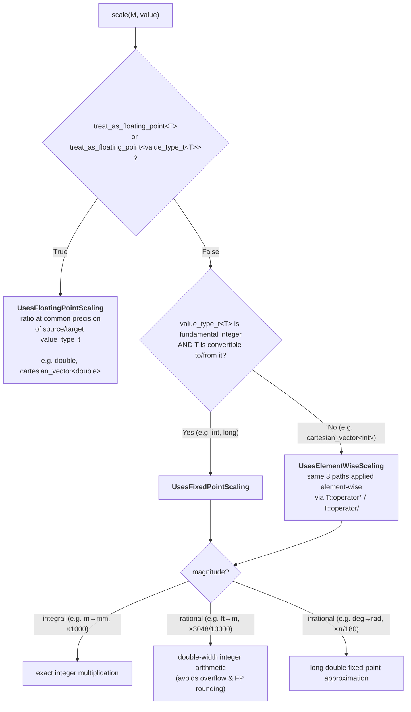

# Representation Types

Every quantity in **mp-units** has a **representation type** that stores the numerical value.
While the library works seamlessly with fundamental arithmetic types (except `bool`) and
`std::complex`, you can also use custom representation types to model domain-specific
requirements—such as range-validated values, vectors, or specialized numeric types.

The representation type determines what kind of mathematical operations are available and
how the quantity behaves in calculations. To ensure type safety, the library verifies that
your representation type has the capabilities required for the quantity's
[character](character_of_a_quantity.md).


## Representation Requirements

To be used as a representation type in **mp-units**, a type must satisfy the
[`RepresentationOf`](concepts.md#RepresentationOf) concept. The library supports different
types of representations corresponding to different quantity characters.

**Why verify representation capabilities?** The same unit can represent fundamentally different
physical concepts requiring different mathematical operations. For example:

- _speed_ (scalar, magnitude only) vs. _velocity_ (vector, magnitude and direction) both
  use m/s,
- _mass_ (scalar) uses kg while _weight force_ (vector, pointing downward) uses N.

The library tracks **character in the quantity specification** (what the quantity represents)
and verifies that your **representation type provides the required capabilities** (can it
handle the operations?). This dual approach provides **compile-time type safety** for the
mathematical nature of physical quantities—preventing, for example, using a scalar type where
vector operations like cross product are needed.

The following table summarizes the requirements for different representation characters:

| Requirement                                                 |          Real Scalar           |                        Complex Scalar                         |                             Vector                             |                          Tensor                          |
|-------------------------------------------------------------|:------------------------------:|:-------------------------------------------------------------:|:--------------------------------------------------------------:|:--------------------------------------------------------:|
| Copyable                                                    |               ✅                |                               ✅                               |                               ✅                                |                            ✅                             |
| Addition/subtraction (`+`, `-`, unary `-`)                  |               ✅                |                               ✅                               |                               ✅                                |                            ✅                             |
| [`MagnitudeScalable`](#how-scaling-works) (unit-conversion) |               ✅                |                               ✅                               |                               ✅                                |                            ✅                             |
| Self-scalable (`T * T`, `T / T`)                            |               ✅                |                               ✅                               |                               -                                |                            -                             |
| Equality comparable (`==`)                                  |               ✅                |                               ✅                               |                               ✅                                |                            ✅                             |
| Totally ordered (`<`, `>`, `<=`, `>=`)                      |               ✅                |                               -                               |                               -                                |                            -                             |
| Not a quantity type itself                                  |               ✅                |                               ✅                               |                               ✅                                |                            ✅                             |
| **Construction**                                            |               -                |                        `T{real, imag}`                        |                               -                                |                            -                             |
| **Required CPOs**                                           |               -                | `mp_units::real()`, `mp_units::imag()`, `mp_units::modulus()` |                       `mp_units::norm()`                       |                    `mp_units::norm()`                    |
| **Opt-out mechanism**                                       |       `disable_real<T>`        |                               -                               |                               -                                |                            -                             |
| **Examples**                                                | `int`, `double`, `long double` |                    `std::complex<double>`                     | `Eigen::Vector3d`, `cartesian_vector<double>`, `int`, `double` | `Eigen::Matrix3d`, `int`, `double` (for scalar measures) |

??? note "Weakly Regular Types"

    All representation types must be **weakly regular**, which means they satisfy the
    `std::regular` concept except for the default-constructibility requirement. Specifically,
    they must be:

    - **Copyable** (`std::copyable`)
    - **Equality comparable** (`std::equality_comparable`)

    This ensures that representation types have value semantics suitable for use in quantities.
    Default construction is not required, allowing types like range-validated representations
    that may not have a meaningful default value.

??? note "Complex Types Construction and Total Ordering"

    **Construction**

    Complex scalars **must** be constructible from real and imaginary parts: `T{real_value, imag_value}`.
    This requirement is essential for operations that combine real-valued quantities into complex results.
    For example, combining _active power_ and _reactive power_ into _complex power_:

    ```cpp
    quantity active = isq::active_power(100.0 * W);
    quantity reactive = isq::reactive_power(50.0 * W);
    // Library needs to construct: std::complex<double>{active.numerical_value(), reactive.numerical_value()}
    ```

    **Total Ordering**

    The library assumes that well-designed complex-like types do not provide total ordering
    (`operator<`, etc.) since there is no natural ordering for complex numbers. If you have
    a complex-like type that does provide ordering operators (e.g., lexicographical comparison
    for use in containers), use the `disable_real` opt-out mechanism:

    ```cpp
    template<>
    constexpr bool mp_units::disable_real<my_complex_type> = true;
    ```

    Alternatively, the library could explicitly check for the absence of `mp_units::real()` and
    `mp_units::imag()` operations to distinguish real from complex scalars. This is a design
    choice that may be refined based on standardization discussions.

??? note "Why Different CPO Names?"

    **Scalars use `modulus()`, Vectors and Tensors use `norm()`**

    While mathematically related, these represent different domain conventions:

    - **`modulus()`**: Traditional complex analysis terminology for magnitude of complex numbers
    - **`norm()`**: Standard linear algebra terminology used across industry (Eigen, NumPy, MATLAB, Armadillo)

    The library follows established domain conventions rather than imposing a single unified terminology.
    This makes it more intuitive for users with backgrounds in complex analysis (who expect `modulus()`)
    or linear algebra (who expect `norm()`). Additionally, `magnitude()` is provided as an alias for
    `norm()` when working with vectors, as "magnitude" is familiar terminology in physics education,
    allowing users to choose the name that best fits their domain.

??? note "Arithmetic Types Satisfy Multiple Characters"

    **Scalars work as 1D vectors and scalar tensor measures**

    Arithmetic types like `int` and `double` satisfy requirements for:

    - Real scalar character (primary use)
    - Vector character (representing 1-dimensional vectors)
    - Tensor character (representing scalar measures like von Mises stress, principal stress)

    This is intentional and extremely common in engineering practice:

    ```cpp
    // All valid uses of double:
    quantity m = isq::mass(5.0 * kg);           // Scalar
    quantity v = isq::velocity(10.0 * m/s);     // 1D vector
    quantity sigma = isq::stress(100.0 * Pa);   // Scalar tensor measure
    ```

    The type safety comes from **`quantity_character`** matching in the quantity specification,
    not from mutually exclusive representation concepts. The `RepresentationOf` concept ensures
    your representation type has the capabilities needed for the quantity's character.

    **Engineering practice with tensors:**

    Most engineering doesn't work with full tensor representations (like 3×3 matrices). Instead,
    scalar measures are extracted and used for analysis:

    - **_Von Mises stress_**: Single scalar derived from _stress tensor_ (used for failure prediction)
    - **_Principal stresses_**: Three eigenvalues from _stress tensor_
    - **_Shear stress_ components**: Individual tensor elements
    - **_Hydrostatic stress_**: Average of diagonal elements

    This is why arithmetic types work for tensor quantities—they represent these scalar measures
    commonly used in finite element analysis, structural engineering, and materials science.


## How Scaling Works?

Every representation type must be **unit-conversion scalable** — the library must be able
to apply a unit magnitude ratio to it internally. This is captured by the `MagnitudeScalable`
concept, which directly names the three supported scaling paths:

```cpp
concept MagnitudeScalable =
  WeaklyRegular<T> && (UsesFloatingPointScaling<T> || UsesFixedPointScaling<T> || UsesElementWiseScaling<T>);
```

The three sub-concepts and their requirements:

```cpp
// Floating-point type, or container whose element type is floating-point
// (e.g. double, cartesian_vector<double>).
concept UsesFloatingPointScaling =
  (treat_as_floating_point<T> || treat_as_floating_point<value_type_t<T>>) &&
  requires(T value, value_type_t<T> f) {
    { value * f } -> WeaklyRegular;
    { value / f } -> WeaklyRegular;
  };

// Fundamental integer type, or a wrapper that is implicitly convertible to/from it
// (e.g. int, long, std::int64_t).  value_type_t<T> must be std::integral (not just
// an integer-like type) because the implementation uses double_width_int_for_t<>.
concept UsesFixedPointScaling =
  std::integral<value_type_t<T>> &&
  std::is_convertible_v<T, value_type_t<T>> &&
  std::is_convertible_v<value_type_t<T>, T>;

// Container whose element type is a fundamental integer and which is NOT freely
// convertible to that type (e.g. cartesian_vector<int>).  Scaling is applied
// element-wise via operator* / operator/.
concept UsesElementWiseScaling =
  std::integral<value_type_t<T>> &&
  !std::convertible_to<T, value_type_t<T>> &&
  requires(T value, value_type_t<T> f) {
    { value * f } -> std::common_with<T>;
    { value / f } -> std::common_with<T>;
  };
```

Most standard types satisfy `MagnitudeScalable` automatically. See
[Scaling operators](#scaling-operators) in the Customization Points section for how to
provide `operator*` and `operator/` for your own types.

### Built-in scaling algorithm

When two quantities of convertible units are combined or converted, the library applies the
unit magnitude `M` to the representation value via `detail::scale<To>(M, value)`. The
built-in decision tree is:



The integer paths (`UsesFixedPointScaling` / `UsesElementWiseScaling`) never promote
values to floating-point, even for the rational and irrational sub-paths. This is
intentional: the user explicitly chose an integer representation type, opting out of
floating-point arithmetic. Their platform may lack FP hardware (embedded systems, DSPs),
rely on software-emulated FP (slow and unpredictable), or enforce a no-FP policy. The
library respects that choice throughout unit conversion.

??? question "Why fixed-point arithmetic for integer representations?"

    1. **Lossless conversions must stay exact**

        `42 * m` converted to `mm` must give exactly `42000 * mm`. Integer multiplication
        achieves this; going via `double` would produce correct results for small values
        but lose exactness near the precision limit (53-bit mantissa ≈ 9×10¹⁵).

    2. **Rational factors remain exactly representable**

        The library multiplies by the numerator, then divides by the denominator
        using integer arithmetic. The result is exact whenever the integer is
        divisible by the denominator. Requiring an explicit cast signals that
        truncation might occur.

    3. **Irrational factors are an unavoidable last resort**

        π/180 (deg→rad), √2, etc. cannot be represented exactly in any integer arithmetic.
        The library falls back to a `long double` approximation and rounds the result
        to the target integer type ("fixed-point approximation").

    The design preference order is therefore:
    **exact integer > exact rational > approximate irrational**.

??? question "Why double-width integers for the rational path?"

    The library computes `value * numerator / denominator` entirely in integer
    arithmetic. Without extra width, the intermediate product
    `value * numerator` can overflow even when the final result fits — for example,
    converting feet to metres multiplies by 3048 before dividing by 10000, which
    overflows a 64-bit integer for values above ~3×10¹⁵.

    Double-width integers (e.g. 128-bit for 64-bit values) absorb that intermediate
    growth. Using `long double` instead would violate the no-FP principle above and
    introduce rounding (`0.3048` is not exactly representable in binary floating-point),
    and on ARM / Apple Silicon `long double == double` anyway, giving no extra range.

If different internal fields need different scale factors, encode that logic in
`operator*` and `operator/` — the library routes scaling through them via the
appropriate built-in path. For an example of integrating a third-party floating-point
type, see the
[`MyFloat` example](../../how_to_guides/integration/using_custom_representation_types.md#scale)
in the how-to guide.


## Customization Points

The library provides several customization mechanisms for representation types. These fall
into two categories: **Character determination** (what kind of representation type you have)
and **Behavior and values** (how the library interacts with your type).

### Character Determination

#### Customization Point Objects (CPOs)

The library uses several CPOs to support different representation types. Providing these CPOs
determines the **character** of your representation type. Each CPO checks for implementations
in the following priority order:

**`mp_units::real(c)`** - Returns the real part of a complex number:

1. `c.real()` member function
2. `real(c)` free function found via ADL

**`mp_units::imag(c)`** - Returns the imaginary part of a complex number:

1. `c.imag()` member function
2. `imag(c)` free function found via ADL

**`mp_units::modulus(c)`** - Returns the magnitude of a complex number:

1. `c.modulus()` member function
2. `modulus(c)` free function found via ADL
3. `c.abs()` member function
4. `abs(c)` free function found via ADL

**`mp_units::norm(v)`** - Returns the norm (magnitude) of a vector or tensor as a scalar:

1. `v.norm()` member function
2. `norm(v)` free function found via ADL
3. For arithmetic types: `std::abs(v)`
4. For real scalar types: `v.abs()` member function
5. For real scalar types: `abs(v)` free function found via ADL

**`mp_units::magnitude(v)`** - Returns the magnitude of a vector as a scalar:

1. Delegates to `mp_units::norm(v)` (provided for compatibility with physics terminology)

!!! note "Why `abs()` is also checked?"

    **Complex Scalars (`modulus()` CPO)**

    Provides compatibility with `std::complex` and similar types that use `abs()` as the
    function name for returning the modulus value. This is checked as a fallback if
    `modulus()` is not provided.

    **Vectors and Tensors (`norm()` CPO)**

    Allows real scalar types (like `int`, `double`) to represent:

    - **1-dimensional vectors** (very common in engineering for linear motion)
    - **Scalar tensor measures** (von Mises stress, principal stress, etc.)

    This enables seamless use of arithmetic types for scalar, vector, AND tensor quantities,
    which accurately reflects real engineering practice where most calculations use scalar
    values rather than full vector/tensor representations.

---

#### `disable_real<T>`

A specializable variable template to opt out a type from being treated as a real scalar:

```cpp
template<typename T>
constexpr bool mp_units::disable_real = false;
```

**Purpose:** Controls the **character** of your representation type by preventing it from
being classified as a real scalar, even if it satisfies the real scalar requirements
(copyable, totally ordered, supports arithmetic operations).

**When to specialize:** If your type accidentally satisfies the real scalar requirements
but shouldn't be used as one:

```cpp
template<>
constexpr bool mp_units::disable_real<my_type> = true;
```

**Example use case:** The library uses this internally to prevent `bool` from being used
as a scalar representation, even though `bool` is technically totally ordered and supports
arithmetic operations.

---

### Behavior and Values

#### `value_type` or `element_type`

The library uses `value_type_t<T>` to determine the underlying arithmetic type of your
representation, which is used for:

- Determining the scaling factor type (what type to multiply/divide your type by)
- Checking if the type should be treated as floating-point

How it works:

1. If your type has a `value_type` or `element_type` member type (checked via `std::indirectly_readable_traits`),
   the library recursively unwraps it until it finds the underlying type
2. Otherwise, your type itself is used as the value type

**Recommendation:** Provide a `value_type` member type for wrapper types:

```cpp
template<typename T>
class my_wrapper {
public:
  using value_type = T;  // Exposes the underlying type
  // ...
};
```

**Third-party types:** If you cannot modify the source of a type (e.g., a third-party
floating-point or fixed-point class), specialize `std::indirectly_readable_traits` to
expose its element type:

```cpp
// Third-party type MyFloat wraps long double internally.
template<>
struct std::indirectly_readable_traits<MyFloat> {
  using value_type = long double;
};
```

This makes `value_type_t<MyFloat>` resolve to `long double`, giving the library the correct
precision for scaling and ensuring the right `common_type` is used in mixed conversions.

!!! warning "Don't provide both `value_type` and `element_type`"

    If your type provides both `value_type` and `element_type` that refer to **different types**,
    `std::indirectly_readable_traits<T>::value_type` will be ill-formed (undefined), and your type
    won't work with the library. If both exist and refer to the **same type**, that type will be used.

    **Recommendation:** Provide only `value_type` unless you have a specific reason to provide both
    (e.g., satisfying iterator concepts), in which case ensure they refer to the same type.

---

#### `treat_as_floating_point<Rep>` { #treat_as_floating_point }

A specializable variable template that tells the library whether a type should be treated as
floating-point for the purpose of allowing implicit conversions:

```cpp
template<typename Rep>
constexpr bool mp_units::treat_as_floating_point = /* implementation-defined */;
```

**Default behavior:**

- In hosted environments: uses `std::chrono::treat_as_floating_point_v<value_type_t<Rep>>`
- In freestanding: uses `std::is_floating_point_v<value_type_t<Rep>>`

**When to specialize:** If you have a custom type that wraps a floating-point value but the
automatic detection doesn't work correctly:

```cpp
template<>
constexpr bool mp_units::treat_as_floating_point<my_fixed_point_type> = true;
```

**Impact:** When `treat_as_floating_point<Rep>` is `true`, the type is treated as floating-point
for conversion purposes. See [Value Conversions](value_conversions.md#value-conversions) for details
on how this affects implicit conversions between quantities.

---

#### Scaling operators { #scaling-operators }

The library scales a representation value by calling `value * factor` and `value / factor`,
where `factor` is of type `value_type_t<T>`. These operators must be provided so that the
built-in scaling paths can apply the unit magnitude ratio during unit conversions.

**For your own types**, provide these as hidden friends (defined inside the class
body, found only via ADL):

```cpp
template<typename T>
class my_wrapper {
  T value_;
public:
  using value_type = T;

  // Hidden friends — preferred over non-member overloads
  friend constexpr my_wrapper operator*(my_wrapper v, T factor) { return my_wrapper{v.value_ * factor}; }
  friend constexpr my_wrapper operator/(my_wrapper v, T factor) { return my_wrapper{v.value_ / factor}; }
};
```

**For third-party types you cannot modify**, place non-member operators in the same namespace
as the type so that ADL finds them:

```cpp
namespace third_party {

// Non-member scaling operators for a type you do not own.
// Must be in the same namespace as the type so ADL finds them.
inline ThirdPartyVec operator*(ThirdPartyVec v, double f) { return v.scale(f); }
inline ThirdPartyVec operator/(ThirdPartyVec v, double f) { return v.scale(1.0 / f); }

}  // namespace third_party
```

See [How Scaling Works](#how-scaling-works) for the full built-in scaling algorithm, concept
definitions, and design rationale.

---

#### `implicitly_scalable<FromUnit, FromRep, ToUnit, ToRep>` { #implicitly_scalable }

A specializable variable template that controls whether a conversion from
`quantity<FromUnit, FromRep>` to `quantity<ToUnit, ToRep>` is implicit or requires an
explicit cast via `value_cast`/`force_in`:

```cpp
template<auto FromUnit, typename FromRep, auto ToUnit, typename ToRep>
constexpr bool mp_units::implicitly_scalable =
  std::is_convertible_v<FromRep, ToRep> &&
  (treat_as_floating_point<ToRep> ||
   (!treat_as_floating_point<FromRep> && is_integral_scaling(FromUnit, ToUnit)));
```

`mp_units::is_integral_scaling(from, to)` is a `consteval` predicate you can also use
in your own specializations to distinguish the integral-factor case (e.g. `m → mm` (×1000))
from fractional ones (e.g. `mm → m` (÷1000), `ft → m`, `deg → rad`).

Conversions with a fractional factor are always explicit for integer reps.

!!! info

    The customization points above (`value_type`, `treat_as_floating_point`, `operator*`,
    `operator/`) all control **how** the library scales a value during unit conversion.
    `implicitly_scalable` is a separate, orthogonal control that decides **whether** a
    particular conversion is implicit or requires an explicit cast.

**When to specialize:** If your custom type has different implicit-conversion semantics:

```cpp
// my_decimal is safe to receive from double implicitly, but double cannot losslessly
// represent my_decimal (more precision), so that direction stays explicit.
template<auto FromUnit, auto ToUnit>
constexpr bool mp_units::implicitly_scalable<FromUnit, double, ToUnit, my_decimal> = true;

template<auto FromUnit, auto ToUnit>
constexpr bool mp_units::implicitly_scalable<FromUnit, my_decimal, ToUnit, double> = false;
```

**Impact:** Controls whether conversions between quantity types are implicit or require
`value_cast`/`force_in`. See [Value Conversions](../../users_guide/framework_basics/value_conversions.md)
for the full picture.

---

#### `representation_values<Rep>` { #representation_values }

A specializable class template that provides special values for a representation type:

```cpp
template<typename Rep>
struct mp_units::representation_values {
  static constexpr Rep zero() noexcept;  // Required for quantity::zero()
  static constexpr Rep one() noexcept;   // Required for quantity operations
  static constexpr Rep min() noexcept;   // Required for quantity::min()
  static constexpr Rep max() noexcept;   // Required for quantity::max()
};
```

**Default behavior:**

- In hosted environments: inherits from `std::chrono::duration_values<Rep>`
- `zero()`: returns `Rep(0)` if Rep is constructible from `int`
- `one()`: returns `Rep(1)` if Rep is constructible from `int`
- `min()`: returns `std::numeric_limits<Rep>::lowest()` if available
- `max()`: returns `std::numeric_limits<Rep>::max()` if available

**When to specialize:** If your type needs custom special values:

```cpp
template<typename T>
struct mp_units::representation_values<my_custom_type<T>> {
  static constexpr my_custom_type<T> zero() noexcept
  {
    return my_custom_type<T>{T{0}};
  }

  static constexpr my_custom_type<T> one() noexcept
  {
    return my_custom_type<T>{T{1}};
  }

  static constexpr my_custom_type<T> min() noexcept
  {
    return my_custom_type<T>{std::numeric_limits<T>::lowest()};
  }

  static constexpr my_custom_type<T> max() noexcept
  {
    return my_custom_type<T>{std::numeric_limits<T>::max()};
  }
};
```

**Usage:** These values are used by:

- `quantity::zero()`, `quantity::min()`, `quantity::max()` static member functions
- Mathematical operations like `floor()`, `ceil()`, `round()`
- Division by zero checks


## Character-Specific Operations

The library enforces character at compile-time: vector quantities require `scalar_product()` or
`vector_product()` instead of `*`; complex quantities restrict `real()`, `imag()`, and `modulus()`
to quantities of the correct character. See
[Character of a Quantity](character_of_a_quantity.md#character-specific-operations) for full
details and examples.


## Built-in Support

All fundamental arithmetic types except `bool` satisfy the real scalar and 1-D vector
representation requirements:

```cpp
quantity<si::metre, int> length1 = 42 * m;
quantity<si::metre, double> length2 = 3.14 * m;
quantity<si::metre, long double> length3 = 2.718L * m;
```

!!! note "Why is `bool` excluded?"

    Although `bool` technically satisfies the syntactic requirements (it's copyable, totally
    ordered, and supports arithmetic operations), it's excluded via `disable_real<bool> = true`
    because using boolean values as physical quantities rarely makes sense and can lead to
    confusing code.

The library also supports `std::complex` for complex-valued quantities:

```cpp
#include <complex>

std::complex<double> impedance{50.0, 30.0};
quantity z = impedance * si::ohm;  // Complex impedance
```

Beyond these built-in types, **any custom type** works as a representation as long as it
satisfies the [`RepresentationOf`](concepts.md#RepresentationOf) concept for the desired
character. At minimum this means:

- providing `value_type` (or `element_type`) so the library knows the underlying scalar type,
- providing `operator*` and `operator/` with `value_type_t<T>` so the library can scale it
  during unit conversions,
- satisfying the character-specific requirements from the table above (copyable, equality
  comparable, arithmetic operators, CPOs, etc.).

See [Using Custom Representation Types](../../how_to_guides/integration/using_custom_representation_types.md)
for a step-by-step walkthrough, including the complete set of customization points and working
examples.


## See Also

<!-- markdownlint-disable MD013 -->
- [Character of a Quantity](character_of_a_quantity.md) - Understanding quantity characters
- [Value Conversions](value_conversions.md) - How `treat_as_floating_point` affects conversions
- [Concepts](concepts.md#RepresentationOf) - The `RepresentationOf` concept definition
- [Using Custom Representation Types](../../how_to_guides/integration/using_custom_representation_types.md) - Step-by-step guide to creating custom representation types
<!-- markdownlint-enable MD013 -->
